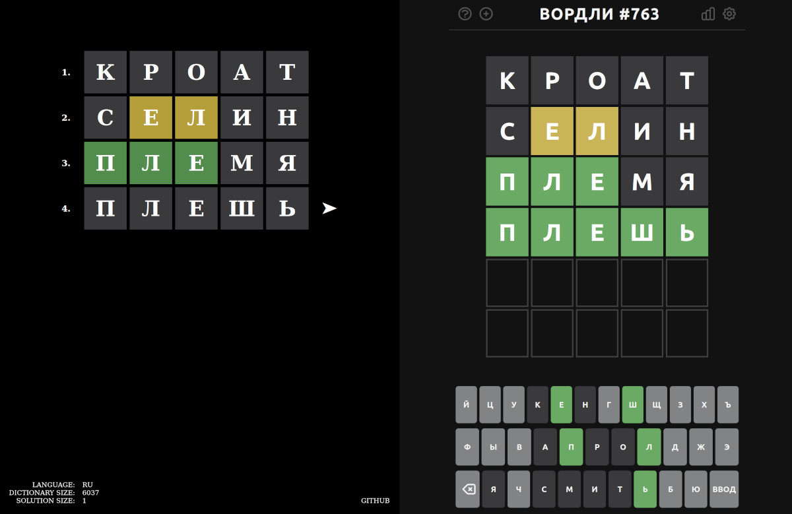

## Wordler

is a lightweight, web based, multi language wordle solver.

- It is language agnostic, can handle LTR and RTL dictionaries with words of any lengths
(not just 5 letters).
- Apart from web GUI, JavaScript code can also be run in Node as a command line utility.
- It uses modern JavaScript with zero dependencies, entire application (except the dictionaries),
minified and gzipped is around 3kB.


## How to use it

The `src` directory has fully functioning code that's ready to go. For example:

```
$ python3 -m http.server --directory src 8080
```

And point your browser at `127.0.0.1:8080` The default gui is interactive. A guess word
is produced and needs to be fed to the wordle interface being solved. In return, guess
results (letter colors) are fed back to Wordler. Process repeats until solution is found.



The Wordler url accepts an optional `test` parameter.

`127.0.0.1:8080?test` - will run automatic tests against all words in the provided dictionary,
with results left in the web console

`127.0.0.1:8080?test=guess` - will run an "interactive" test again one provided word

The two tests can also be run with node:

```
$ node src/index.js src/lang/ar.json
```

```
$ node src/index.js src/lang/fr.json petit
Loaded wordle, language = en, direction = ltr, word size = 5, dictionary size = 6227, alphabet size = 26
trying reais
trying betie
trying tetin
trying petit
guessed petit at try 4
```

Browser language preference is used to determine which dictionary to use. For example,
if you have French  set as your top language, `lang/fr.json.gz` or `lang/fr.json` will be loaded.
Dictionaries live in `lang/` directory and are plain json lists of words.


## Build

A smaller, compressed build can be produced in a standard way:

```
npm install
npm run build
```


## Results

Wordler doesn't build the full graph, it takes much lighter and straightforward approach which also means,
that there is no 100% guarantee on finding solution within the 6 attempts. Efficiency depends on the dictionary
size. Below are results for the eight languages included.

| wordle                                                     | dictionary | alphabet   | 6 row efficiency | 100% efficiency |
|------------------------------------------------------------|------------|------------|------------------|-----------------|
| [Arabic](https://arwordle.netlify.app/)                    | 631 words  | 35 letters | 98.3%            | 8 rows          |
| [English](https://www.nytimes.com/games/wordle/index.html) | 2309 words | 26 letters | 99.2%            | 8 rows          |
| [French](https://wordlefrancais.org/)                      | 6227 words | 26 letters | 93.8%            | 12 rows         |
| [Greek](https://dspinellis.github.io/word-master/)         | 2035 words | 25 letters | 99.4%            | 7 rows          |
| [Hebrew](https://wordlehebrew.github.io/)                  | 2022 words | 28 letters | 98.4%            | 8 rows          |
| [Polish](https://sudoku.pl/wordle/)                        | 7820 words | 33 letters | 95.4%            | 12 rows         |
| [Portuguese](https://termo.pt/)                            | 6499 words | 38 letters | 93.9%            | 11 rows         |
| [Russian](https://wordle.belousov.one/)                    | 6037 words | 32 letters | 97.3%            | 10 rows         |

How to read the above table?

For the original English wordle that has a dictionary of 2309 words, over 99% of them will be guessed
within the 6 rows. However, the worst case takes 8 rows. Frequencies of letters in the dictionary are
used in the process of finding the solution, which is prone to "long tail" cases. In English for example,
words `batch`, `catch`, `match`, `hatch`, `watch` are a close clump and after finding the common suffix,
getting the first letter right poses an elimination problem.
